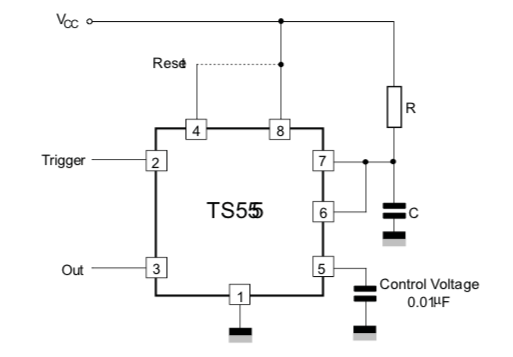

# Deep Reset Tutorial

This tutorial is a simple example of how to use the EN pin on the Argon/Boron/Xenon to power down the device for around 30 seconds. 

Say you have a Boron in a remote location. The device knows it's having trouble connecting to the cloud. Maybe power cycling it would help. This simple circuit powers off both the modem and the nRF52 MCU using an external timer. Pulling the EN line low turns off the load switch powering the modem and the nRF52 MCU on the Boron.

On the Argon and Xenon it powers off the XCL223 3.3V regulator, which will de-power the nRF52 MCU and on the Argon, the ESP32.

After about 30 seconds, the device will be allowed to boot normally.

Updates and the associated files can be found here:
[https://github.com/rickkas7/DeepReset](https://github.com/rickkas7/DeepReset)

## Test Board

This is the test board for this circuit. While you can build this board exactly as is, you'll typically want to include the circuit on your own board rather than dedicate an entire FeatherWing to resetting.


Schematics:


Board layout:


By default D2 is the deep reset pin, but you can change that using the configuration jumper pads on the bottom of the board.

If you set D2 to OUTPUT and make it go HIGH, the device will immediately power down for around 30 seconds, then essentially cold boot. The MCU and modem will be de-powered during this time using the EN pin.

You can tell it's working because the device turns off, the EN pin goes LOW, and 3V3 will become unpowered during this deep reset de-powered phase.

### Eagle directory

The eagle directory in this repository contains:

- DeepReset2.sch - schematic
- DeepReset2.brd - board layout
- DeepReset2v1.zip - Gerbers
- DeepReset2.lbr - library containing all of the components in this design

### BOM

| Quantity | Item | Example |
| --- | --- | --- |
| 2 | 10K resistor 0603 | [Panasonic ERJ-PA3J103V](https://www.digikey.com/product-detail/en/panasonic-electronic-components/ERJ-PA3J103V/P10KBZCT-ND/503623) |
| 1 | 100K resistor 0603 | [Panasonic ERJ-3EKF1003V](https://www.digikey.com/product-detail/en/panasonic-electronic-components/ERJ-3EKF1003V/P100KHCT-ND/198110) |
| 1 | 2.7M resistor 0603 | [Panasonic ERJ-3GEYJ275V](https://www.digikey.com/product-detail/en/panasonic-electronic-components/ERJ-3GEYJ275V/P2.7MGCT-ND/282431) | 
| 1 | 0.01uF capacitor 0603 | [Murata GCM188R72A103KA37J](https://www.digikey.com/product-detail/en/murata-electronics-north-america/GCM188R72A103KA37J/490-8028-1-ND/4380313) |
| 1 | 10uF capacitor 0805 | [Murata GRM21BR61C106KE15L](https://www.digikey.com/product-detail/en/murata-electronics-north-america/GRM21BR61C106KE15L/490-3886-1-ND/965928) | 
| 2 | RS1JFP diode | [ON Semiconductor RS1JFP](https://www.digikey.com/product-detail/en/on-semiconductor/RS1JFP/RS1JFPCT-ND/5722970) |
| 2 | 2N7002 N-MOSFET | [ON Semiconductor 2N7002LT3G](https://www.digikey.com/product-detail/en/on-semiconductor/2N7002LT3G/2N7002LT3GOSCT-ND/2704932) |
| 1 | TS555 Timer | [ST Microelectronics TS555](https://www.digikey.com/product-detail/en/stmicroelectronics/TS555IDTTR/497-16404-1-ND/5959811) | 
| 1 | RT9818 Voltage Detector | [Richtek RT9818C-29GV](https://www.digikey.com/product-detail/en/richtek-usa-inc/RT9818C-29GV/1028-1020-1-ND/2470079) |
| | Male header pins 0.1" | [Sullins PRPC040SAAN-RC](https://www.digikey.com/product-detail/en/PRPC040SAAN-RC/S1011EC-40-ND/2775214) |


## Firmware

This is the test firmware. When you hit the MODE button, the device should immediately go into deep reset for 30 or so seconds.

```
#include "Particle.h"

SYSTEM_THREAD(ENABLED);

SerialLogHandler logHandler;

const int DEEP_RESET_PIN = D2;

void buttonHandler();

void setup() {
	pinResetFast(DEEP_RESET_PIN);
	pinMode(DEEP_RESET_PIN, OUTPUT);

	System.on(button_click, buttonHandler);
}

void loop() {

}

void buttonHandler() {
	Log.info("about to deep reset");

	digitalWrite(DEEP_RESET_PIN, HIGH);

	delay(1000);
	Log.info("this should never be reached");
}

```

The setup code look like this:

```
pinResetFast(DEEP_RESET_PIN);
pinMode(DEEP_RESET_PIN, OUTPUT);
```

Note the use of pinResetFast. This is necessary because digitalWrite does not work before the pin is set to output. Since the default state of outputs is LOW the pinResetFast shouldn't be necessary, but I added it to be safe. This makes sure the pin won't go briefly high, which will cause the device to go to deep reset immediately.


## Configuration Pads

On the bottom side of the board are a number of trace jumpers that configure which pin is the deep reset pin. The default is D2.


To change it, cut the trace on the D2 pads, highlighted here:


Then close one of the other trace jumpers on D3, D4, A0, A1, or A2. A little blob of solder should do it. And, if you want to change it again, you can just vacuum or solder wick the blob off and move it to another pad.

## Circuit Deep Dive


These two RS1JFP diodes allow the board to be powered either by USB or battery for flexibility. It you will only be powered by one or the other you can just skip the diodes, but if you could be powered with either than you'll need the diodes.


One pin is used to enter deep reset by setting the pin as OUTPUT and setting it HIGH. This circuit is necessary for a few reasons:

- The TS555 Timer requires an active low trigger.
- The DRST line connects to the TS555 timer TRIGGER line with a pull-up to PWR, which can be up to 4.9V when powered by USB. Connecting GPIO directly to DRST would damage the GPIO.
- The 2N7002 N-channel MOSFET prevents this higher voltage from flowing backwards into the GPIO pin and also inverts the signal.


The state of the timer at power-up cannot be guaranteed. To make sure that the device immediately starts when powered on, a Richtek RT9818 power detector is connected to the RESET pin on the TS555 timer. There's a 100K weak pull-up on the pin as the RT9818 is an open-collector active-low output. The RT9818 is $0.41 in single quantities. 

You can omit it, however sometimes the device will then go into deep reset at power-up. It will recover after 30 seconds, but it's disconcerting when it happens so I like to include the RT9818.



This circuit is from the datasheet and describes using a 555 timer in monostable (one-shot) mode.

The control voltage capacitor is always 0.01µF. The configurable part is R and C.


The actual circuit has:

- R is 2.7 MΩ
- C is 10µF

The timing formula for monostable operation is:

- 1.1 &times; R &times; C

Where:

- R is in ohms
- C is in Farads

So:

- 1.1 &times; 2.7E<sup>6</sup> &times; 10E<sup>-6</sup> = 29.7 seconds 

[This page](https://www.electronics-tutorials.ws/waveforms/555_timer.html) has a great introduction to the various modes of the 555 timer.

By the way, this particular circuit uses the ST Microelectronics TS555. The classic bipolar 555 timer requires a minimum of 4.5V and 20 mA to do its thing. The TS555 works from 2V to 16V at around 100 µA, making it much better suited for battery-powered applications.


Finally, the output circuit uses a 2N7002 N-channel MOSFET. The timer output is active high, and the MOSFET pull the EN line low when the timer output goes high. The EN line has a 100K weak pull-up on it on the device itself, so this works perfectly.

Also, the TS555 timer can be running at 4.9V when powered by USB. We don't want to drive the EN line with that high of a voltage, so using the N-channel MOSFET in open-collector style is preferable.


